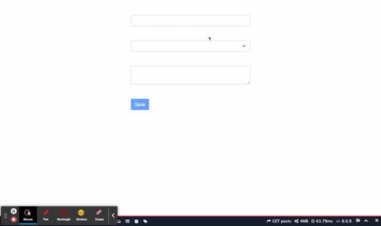

# Disable/Enable Submit Button Using Javascript

## Demo



Create Javascript file named `form-handler.js` and insert below code
```js
// form-handler.js
class formHandler
{
    constructor(form)
    {
        this.form = form;
    }

    disableOrEnableSubmitButton() {
        let submitBtn = document.querySelector(`#${this.form.id} [type="submit"]`);
        submitBtn.disabled = true;
        this.form.addEventListener('input', () => {
            let isDisable = false;
            document.querySelectorAll(`#${this.form.id} [data-required="true"]`).forEach(input => {
                if(! isDisable) {
                    isDisable = input.value == '';
                }
            });
            submitBtn.disabled = isDisable;
        });
    }
}
```

In the `HTML`, give `id` to form element and then the fields that you want to require add data attribute `data-required="true"` after that create `formHandler` instance object with argument that is `form selector` eg. `document.getElementById('myform')`

The submit button will be `disabled` initial. When all fields that has data attribute `data-required="true"` are filled, the submit button will become ready to submit.

```html
<!-- index.html -->
<form action="" id="myform">
    <input type="text" name="name" data-required="true">
    <br><br>

    <input type="email" name="email" data-required="true">
    <br><br>

    <select name="" data-required="true">
        <option value=""></option>
        <option value="one">One</option>
        <option value="two">Two</option>
    </select>
    <br><br>

    <textarea data-required="true"></textarea>
    <br><br>

    <button type="submit" class="btn btn-primary">Save</button>
</form>

<script>
new formHandler(document.getElementById('myform')).disableOrEnableSubmitButton();
</script>
```