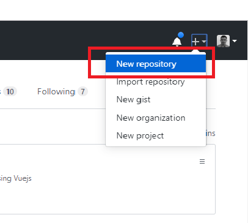
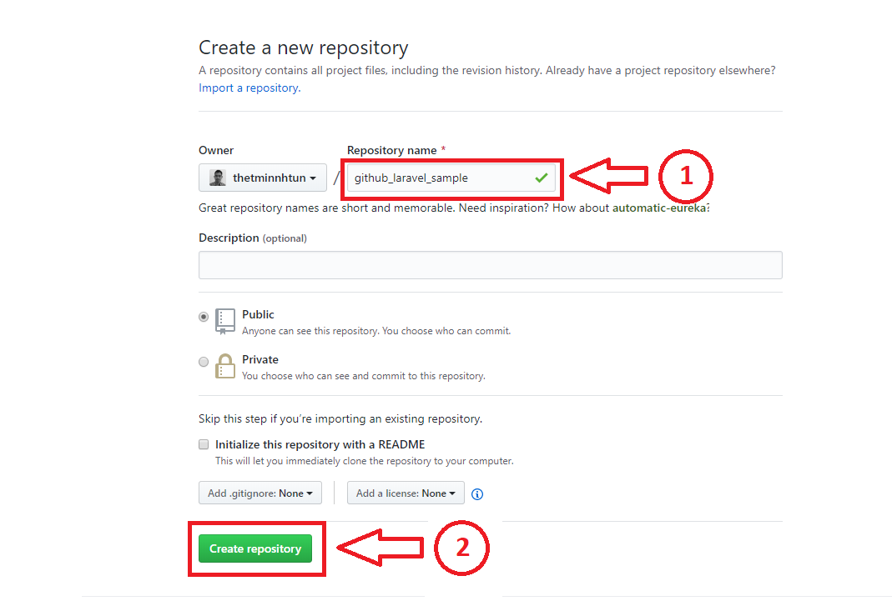
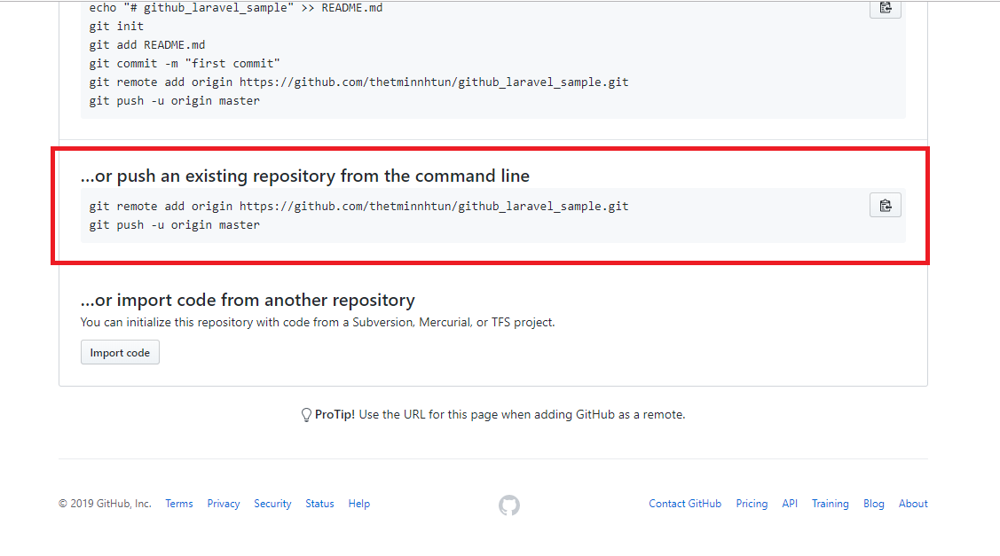
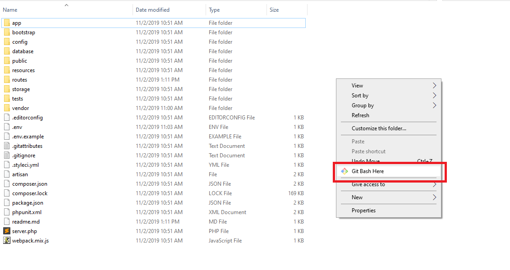
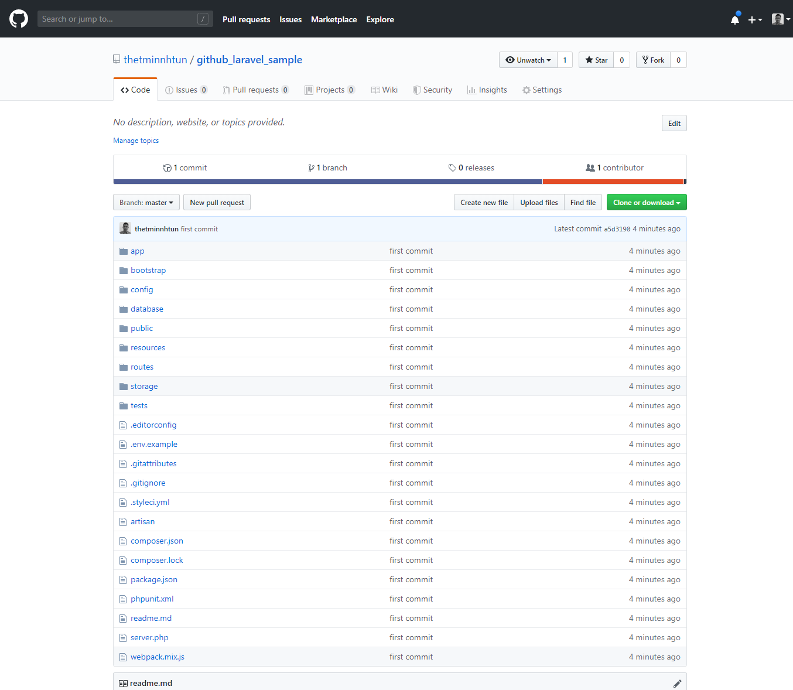

# Uploading laravel Project on GitHub

### Create New Repository

ပထမဦးဆုံး GitHub တွင် repository အသစ်တည်ဆောက်ပါ။



`Repository name` တွင် project name ကိုရေးပြီး `Create repository` Button ကိုနှိပ်ပါ။



အောက်ပါအတိုင်း ပေါ်လာပါက 



အောက်ပါ code ကို copy ကူးထားပါ။

```
git remote add origin https://github.com/thetminnhtun/github_laravel_sample.git
git push -u origin master
```
Laravel Project သို့သွားပြီး Right Click နှိပ်ကာ Git Bash ကိုဖွင့်ကာ အောက်ပါ `commond` ဖြင့် Git initialize လုပ်ပါ။



```
git init
```
ပြီးနောက်ပါ Project souce files များကို အောက်ပါ `command` ကိုအသုံးပြု၍ Git သို့ထည့်ပါ။

```
git add .
```
Git အတွင်းသို့ထည့်ပြီးပါက အောက်ပါ `command` ဖြင့် commit ပြုလုပ်ပါ။
```
git commit -m "write a message what you do in project"
```
commit ပြုလုပ်ပြီးပါက အထက်မှ copy ကူးလာသော 
```
git remote add origin https://github.com/thetminnhtun/github_laravel_sample.git
git push -u origin master
```
code ကို paste လုပ်ကာ GutHub repo path ကို Git နှင့် ချိတ်ကာ GitHub ပေါ်သို့တင်ပါ။

Git push ပြီးပါက GitHub ကို refresh လုပ်ပါ။ အောက်ပါအတိုင်းပေါ်လာပါက Laravel project ကို GitHub ပေါ်သို့ တင်ခြင်းလုပ်ငန်းစဥ်ပြီးဆုံးပါပြီ။

