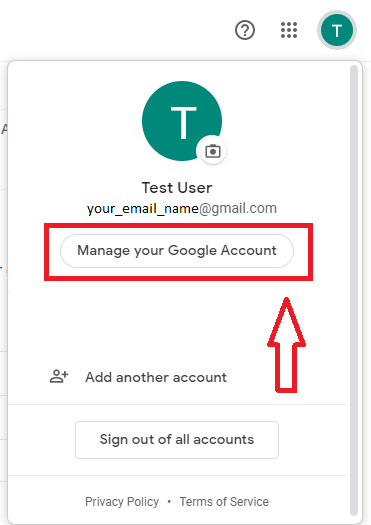

# Mail Verification

- <a href="#gmail_config">Gmail Configuration</a>
- <a href="#installation_laravel">Installation laravel</a>
- <a href="#database_config">Database Configuration</a>
- <a href="#email_config">Email Configuration In Laravel</a>
- <a href="#migration">Migration</a>
- <a href="#creation_auth">Creation Auth</a>
- <a href="#model_prepare">Model Preparation</a>
- <a href="#routing">Routing</a>
- <a href="#protecting_routes">Protecting Routes</a>

<h3 id="gmail_config">Gmail Configuration</h3>

Laravel တွင် Gmail ကို အသုံးပြု၍ Mail ပို့နိုင်ရန်အတွက် Gmail တွင် `Less secure app access` ကို
`On` ထား ပေးရန်လိုသည်။

ပထမဦးစွာ Brower တွင် Gmail Login လုပ်ပါ။ အောက်ပါ ပုံတွင် ပြထားသည့်အတိုင်း
`Manage your Google Account` ကိုနှိပ်ပါ။



`Security` ကို ရွေး၍ `Less secure app access` ကို `On` ပေးပါ။


<h3 id="installation_laravel">Installation laravel</h3>

Laravel ကို Install လုပ်ရန် `Terminal` တွင် အောက်ပါ `command` ကိုအသုံးပြု၍ စက်ထဲသို့ Install
လုပ်ပါ။ ယခု Tutorial တွင် Laravel version 5.8 ကို အသုံးပြုသွားပါမည်။

```
composer create-project --prefer-dist laravel/laravel mailVerify
```

<h3 id="database_config">Database Configuration</h3>

`.env` file တွင် Database'name, Username, Password ထည့်ပါ။

```
DB_CONNECTION=mysql
DB_HOST=127.0.0.1
DB_PORT=3306
DB_DATABASE=mail_verify
DB_USERNAME=root
DB_PASSWORD=
```

ထို့နောက် အောက်ပါ `command` ကိုအသုံးပြု၍ `migrate` ပြုလုပ်ပါ။

```
php artisan migrate
```

<h3 id="email_config">Email Configuration In Laravel</h3>

`.env` file တွင် Gmail ရဲ့ Mail address နဲ့ Password ကိုထည့်ပါ။

```
MAIL_DRIVER=smtp
MAIL_HOST=smtp.gmail.com
MAIL_PORT=587
MAIL_USERNAME=youremail@gmail.com
MAIL_PASSWORD=yourpass
MAIL_ENCRYPTION=tls
```
<h3 id="creation_auth">Creation Auth</h3>

Laravel တွင် တပါတည်းပါ လာသော Authentication လုပ် ဆောင်ချက်ကို
ရရှိရန်အတွက်အောက်ပါ  `command` ကို Run ပေးပါ။

```
php artisan make:auth
```
Laravel version 6 ဖြစ်နေပါက အောက်ပါ `command` ကို အသုံးပြုရပါမည်။

မှတ်ချက်။ ။စက်ထဲတွင် [NPM(Node Package Manage)](https://nodejs.org/en/download/) ရှိရန်လိုပါအပ်သည်။
```
composer require laravel/ui --dev

php artisan ui vue --auth

npm install

npm run dev
```

<h3 id="model_prepare">Model Preparation</h3>

`App\User` model တွင် `Illuminate\Contracts\Auth\MustVerifyEmail` Interface ကို
Implement ပြုလုပ်ပေးရန်လိုအပ်သည်။

```php
<?php

namespace App;

use Illuminate\Contracts\Auth\MustVerifyEmail;
use Illuminate\Foundation\Auth\User as Authenticatable;
use Illuminate\Notifications\Notifiable;

class User extends Authenticatable implements MustVerifyEmail
{
    use Notifiable;

    // ...
}
```
<h3 id="routing">Routing</h3>

`web.php` တွင် `Auth::routes()` method တွင် အောက်ပါ အတိုင်း `['verify' => true]` ကို Parameter အနေဖြည့် ထည့်ပေးပါ။

```php
Auth::routes(['verify' => true]);
```

<h3 id="protecting_routes">Protecting Routes</h3>

Email verify လုပ်စေလိုသော Route တွင် `verified` Middleware သုံးနိုင်ပါတယ်။

```php
Route::get('profile', function () {
    // Only verified users may enter...
})->middleware('verified');
```

__Reference__ [Laravel Documentation](https://laravel.com/docs/5.8/verification)
